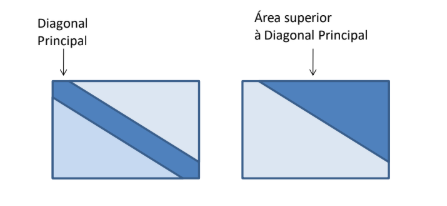

# TC 2
1. Faça um algoritmo que leia uma string e conte a quantidade de vogais.
2. Faça um algoritmo que leia uma string e determine se ela é palíndrome (igual se lida de trás pra frente).
3. Supondo que a população de um país A seja da ordem de 90.000.000 habitantes, com uma taxa anual de crescimento de 3%, e que a população de um país B seja aproximadamente de 200.000.000 habitantes, com uma taxa anual de crescimento de 1,5%. Faça uma matriz 20x2, onde, na primeira e segunda colunas da matriz devem ser calculados o crescimento populacional para o país A e B, respectivamente. A linha zero da matriz indica o cálculo para o próximo ano, e assim sucessivamente. O programa deve mostrar ainda o resultado (matriz) na tela e apresentar a resposta para as perguntas “Em 20 anos o país A terá população maior que o B? Se sim, em qual ano A passa B?”.
4. Criar um programa em C que leia uma matriz M(8,8) de inteiros e calcule a soma separadamente dos elementos presentes nas partes mais escuras das figuras. Imprimir os elementos da matriz M e os resultados dos cálculos das somas.

